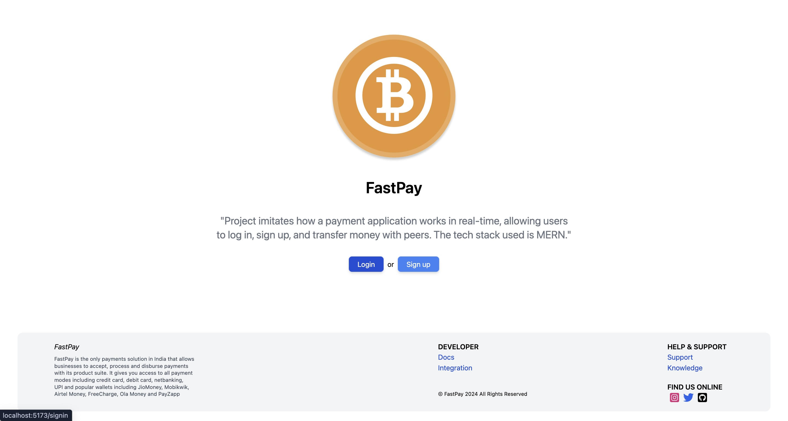
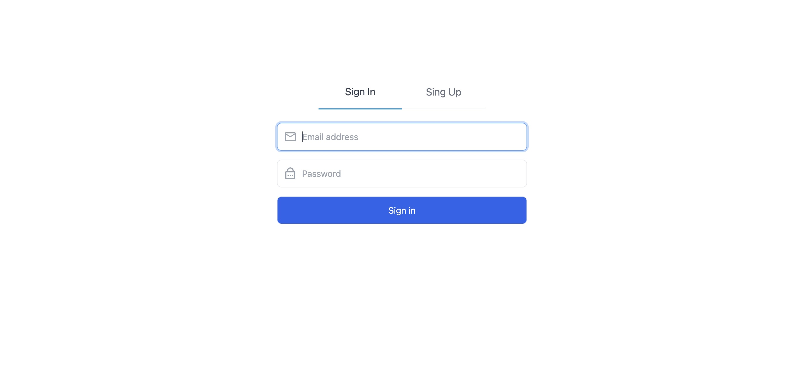
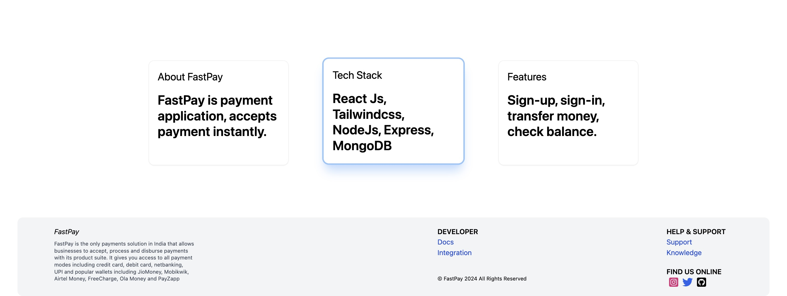
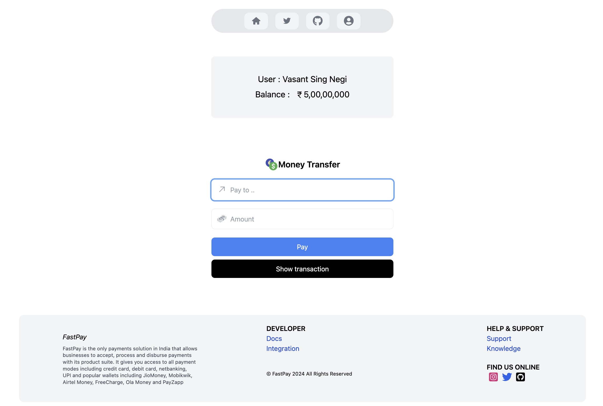
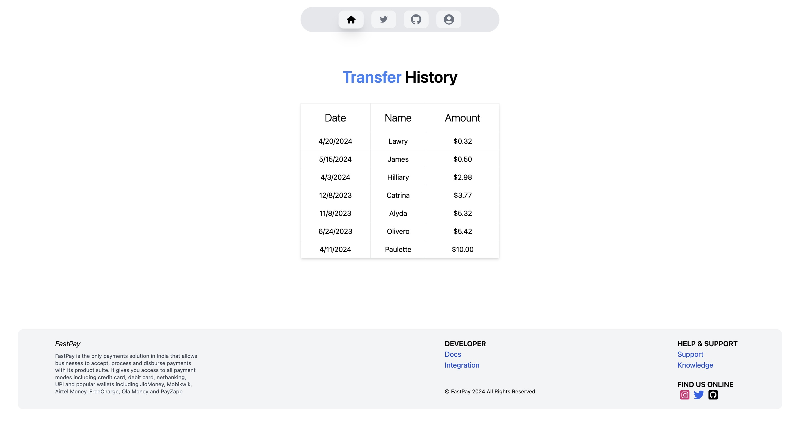

# FastPay

A payment application.

## Teach Stack

1. React Js
2. Tailwind css
3. Redux / ReduxToolkit
4. Node Js
5. Express
6. MongoDB

## Features

1. Sign-in, Sign-up.
2. Transfer money to peers.

## Snapshots

    Application is responsive

### Landing page

### Sign-up & Sign-in page

### Dashboard page

### User details page

### Transaction history page

